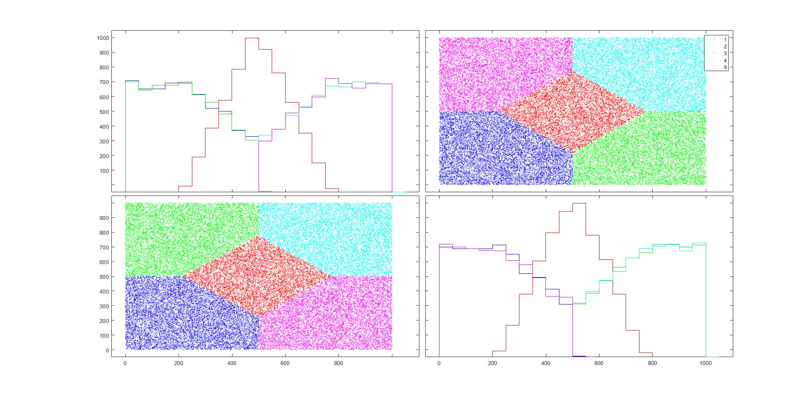
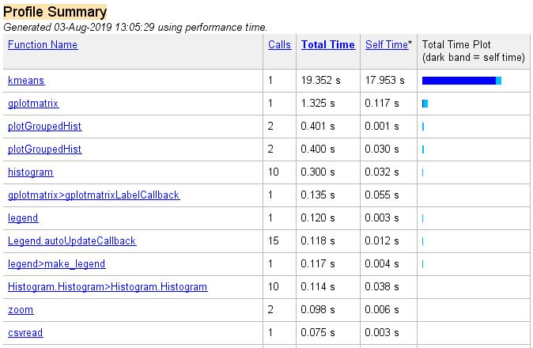
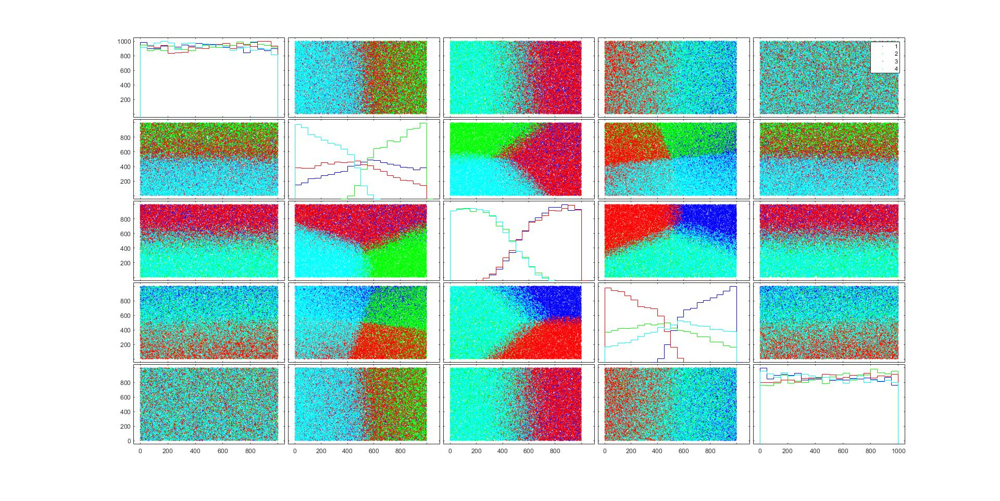
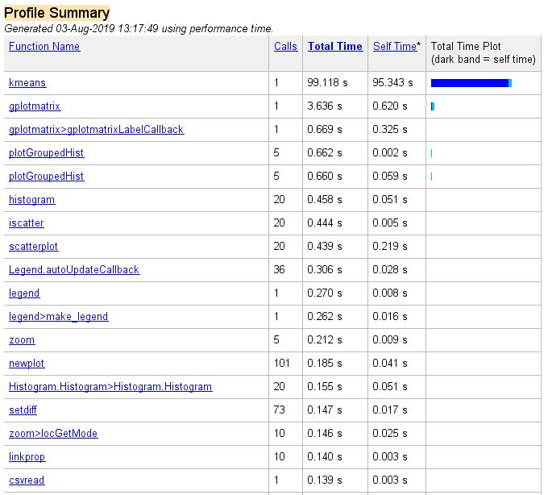

# K-Means-Clustering-Algorithm
K-Means Kümeleme Algoritması (MATLAB)

<b>5 kümede 2 parametreli 50.000 gözlem</b>  
<b>2-parameter 50.000 observation 5 clustering</b>  

   
<b>4 kümede 5 parametreli 50.000 gözlem</b>   
<b>5-parameter 50.000 observation 4 clustering</b>  

